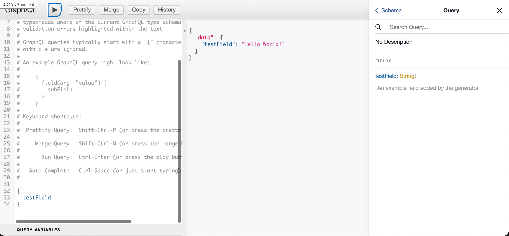

# GraphQL Example

## Add graphql gem to dependencies

Add to your Gemfile:

```ruby
gem 'graphql'
```

...then run in your console:

```shell
bundle install
```

## Install GraphQL gem


```shell
rails g graphql:install
```

It's going to ask you to run again a ***bundle install***.
This step also adds a new Gem to your Gemfile called ***graphiql-rails***,
this is a Web Query Interface for testing our GraphQL integration with Rails.

## Run Rails server and access GraphiQL page

```shell
rails server
```

On your browser, access: http://localhost:your_port/graphiql

You are going to see something like this:


